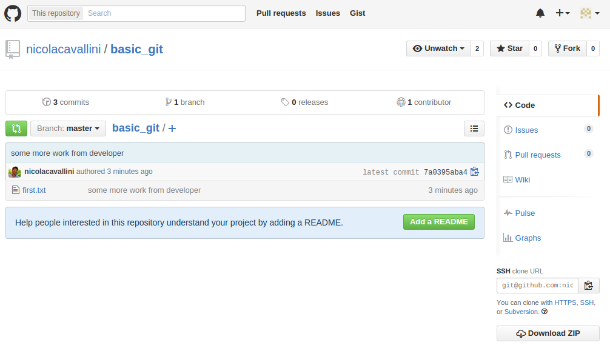
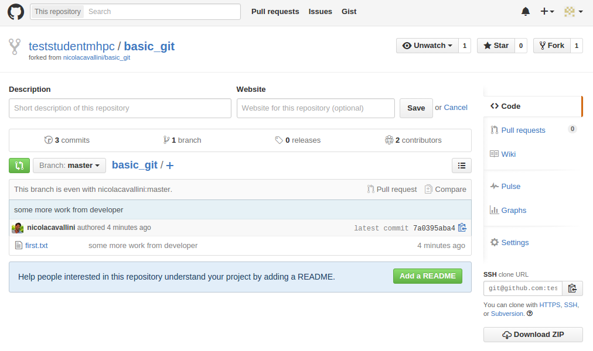
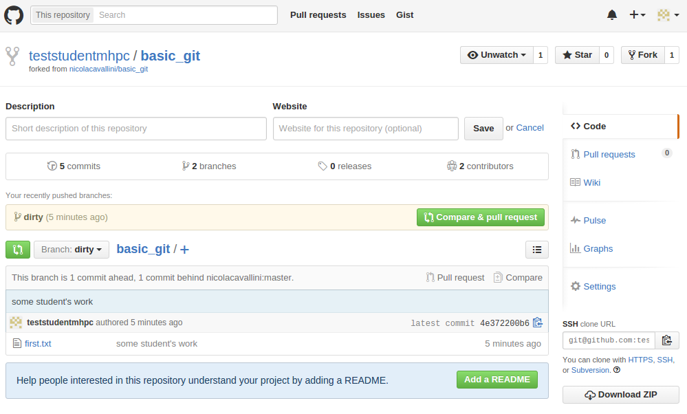
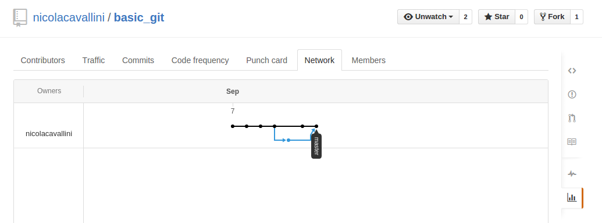

# Remote repositories.
We can define a `remote` as a version of your project, hosted at some url. Avaliable protocols are:

- `ssh://`
- `http[s]://`
- `git://`
- `file://`

We refer to the most common situation of a project hosted on GitHub, and `clone` our test repository `basc_git`.
```
$ git clone git@github.com:nicolacavallini/basic_git.git
Cloning into 'basic_git'...
warning: You appear to have cloned an empty repository.
Checking connectivity... done.
```
A good idea would be to check the romte on our local version, this is done in two ways. First:
```
$ git remote -v
origin	git@github.com:nicolacavallini/basic_git.git (fetch)
origin	git@github.com:nicolacavallini/basic_git.git (push)
```
Second:
```
$ git remote show origin
* remote origin
  Fetch URL: git@github.com:nicolacavallini/basic_git.git
  Push  URL: git@github.com:nicolacavallini/basic_git.git
  HEAD branch: master
  Remote branch:
    master tracked
  Local branch configured for 'git pull':
    master merges with remote master
  Local ref configured for 'git push':
    master pushes to master (up to date)
```
Notice that `origin` is nothing but a default name for a remote. Remote repositories are used to `push` and `pull` data. Now that we have a working copy of the projet, doing some work would be a good idea:
```
vim first.txt
git commit -a -m "first commit by..."
```
At this level everything we did was local. Pushing our jod to the remote url named `origin` on the `master branch`is just as simple as:
```
$ git push origin master
Counting objects: 3, done.
Writing objects: 100% (3/3), 243 bytes | 0 bytes/s, done.
Total 3 (delta 0), reused 0 (delta 0)
To git@github.com:nicolacavallini/basic_git.git
 * [new branch]      master -> master
```
Now check the GitHub web page you'll see your work has been loaded online.
**Agenda sunt:** Let the lecturer push some work, and try to push yourself. What happens?

#Managing Remotes and the Correct Way to Collaborate.
Suppose now it's 30 people collaborating on the same project. It would be than a good idea to have your own remote version, together with the development remote version of the repository. Git based platforms such has GitHub, provide this feature, and they often call it *Fork*. 





Now that you have your own remote copy of the project you can clone it:
```
$ git clone git@github.com:teststudentmhpc/basic_git.git
Cloning into 'basic_git'...
Warning: Permanently added the RSA host key for IP address '192.30.252.130' to the list of known hosts.
remote: Counting objects: 9, done.
remote: Compressing objects: 100% (4/4), done.
remote: Total 9 (delta 1), reused 9 (delta 1), pack-reused 0
Receiving objects: 100% (9/9), done.
Resolving deltas: 100% (1/1), done.
Checking connectivity... done.
```
You want to link your local copy, with your remote and the ufficial remote. This is done adding the ufficial repo to your remote list:
```
$ git remote add nicola git@github.com:nicolacavallini/basic_git.git
$ git remote -v
nicola	git@github.com:nicolacavallini/basic_git.git (fetch)
nicola	git@github.com:nicolacavallini/basic_git.git (push)
origin	git@github.com:teststudentmhpc/basic_git.git (fetch)
origin	git@github.com:teststudentmhpc/basic_git.git (push)
```

Suppose you go and get a coffe, and the developers have pushed some work into the project. It is a good idea to sync your local and remote repositories with the original one.
```
$ git fetch --all 
Fetching origin
Fetching nicola
remote: Counting objects: 3, done.
remote: Compressing objects: 100% (1/1), done.
remote: Total 3 (delta 1), reused 3 (delta 1), pack-reused 0
Unpacking objects: 100% (3/3), done.
From github.com:nicolacavallini/basic_git
 * [new branch]      master     -> nicola/master
```
You want `nicola/master` branch to be merged on your local and remote copies. You need first to set your `HEAD` to `master` on local repository.
```
$ git checkout master
Already on 'master'
Your branch is up-to-date with 'origin/master'.
```
Then you want to `merge` local with `nicola/master`.
```
$ git merge nicola/master
Updating 7a0395a..e7c0b24
Fast-forward
 first.txt | 2 +-
 1 file changed, 1 insertion(+), 1 deletion(-)
 ```
 And finally push this data to the remote branch.
 ```
$ git push origin master
Counting objects: 5, done.
Compressing objects: 100% (2/2), done.
Writing objects: 100% (3/3), 326 bytes | 0 bytes/s, done.
Total 3 (delta 1), reused 0 (delta 0)
To git@github.com:teststudentmhpc/basic_git.git
   7a0395a..e7c0b24  master -> master
```
It's your time to work, finally. A good habit is to keep the master branch *untouched* and do your dirty stuff into a local branch:
```
$ git checkout -b dirty
Switched to a new branch 'dirty'
$ git branch
* dirty
  master
$ vim first.txt 
$ git commit -a -m "some student's work"
[dirty 4e37220] some student's work
 1 file changed, 1 insertion(+), 1 deletion(-)
$ git push origin dirty
Counting objects: 5, done.
Compressing objects: 100% (2/2), done.
Writing objects: 100% (3/3), 305 bytes | 0 bytes/s, done.
Total 3 (delta 1), reused 0 (delta 0)
To git@github.com:teststudentmhpc/basic_git.git
 * [new branch]      dirty -> dirty
```
Now you believe that your dirty work is good enought to be shared with the community, but you want it to be reviwed by the developers. What you usually do is create a *pull request*.


